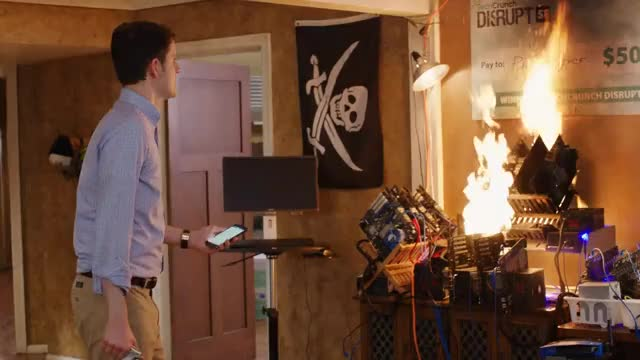

# Postmortem Report: The Squirrel Nest Rescue, 12/12/2112 

## Summary: 
	
	The first outage happened from 8:30 AM - 12:30 PM.
	We started to notice the bottleneck in our incoming
	traffic so we scaled up our in-house data center simply
	because we didn't have enough compute at the moment.
 
	The second outage lasted way longer as we had to port 
	our codebase to a third-party data center which was from 1 PM
	to 5 PM the next day. This time, there was a fire hazard as the 
	servers were running really hot due to the high volume of incoming
	traffic and we had to pull the plug and port to external compute.

## Timeline:

#### 12/12/2112
	- 8:30 AM: We notice the number of streams on our live feed of a squirrel being rescued
	slowly increasing until Mike Tyson tweets a link to our stream. We scale-up the in house data center
	with more servers.
	- 12:30 AM: Despite all the compute scaling, because the link has gone viral at this point, 
	the servers are running very hot. We continue to add servers.
	
	Meanwhile engineers are optimizing the code.
	- 5:00 PM: We manage to get power all the servers using the main power line, which is dangerous but had to
	be done.
	- 5:45 PM: Servers start to catch on fire. They are extinguished and our feed goes down.
	- 6:00 PM: Our CTO is on the phone with a collegue at Microsoft who manages the Azure team
	 to cut a quick compute deal.
#### 12/13/2112
	- 5:00 PM: After working almost round the clock, our codebase is finally deployed and back up and running.

## Root Cause:

### Outage 1:
	We simply did not have compute at our disposal to handle the incoming load. Since we were hosted in our own
	local data center, we started to add servers manually as quickly as we could, and this fixed the problem 
	until the video stream really went viral on the internet.
### Outage 2:
	After implenting many electical hacks to the office's main circut board, we were able to power all the servers and manage
	the load we had, but heat was quickly becoming an issue. We did not have the extra headroom for cooling
	nor really the time. Since we maxed out the amperage, there was a risk of the breaker even blowing out, as it was 
	jammed.
	
	Here is one the servers starting to catch fire:
	

## Resolution: 

	- Codebase can definately be optimized to handle incoming requests better and to integrate more efficiently with Azure.
	- Caching mechanisms need to be optimized on the client-side to improve our compression algorithm.
	- Work on a way to reduce P2P swarms.
	- Work out a better deal with Azure once the current contract ends to maximize runway.	
